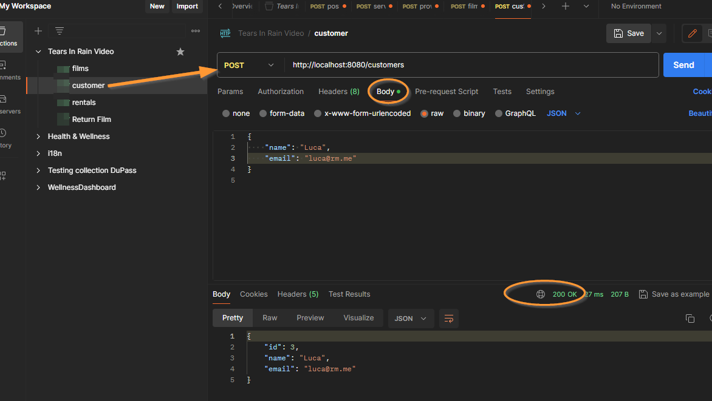
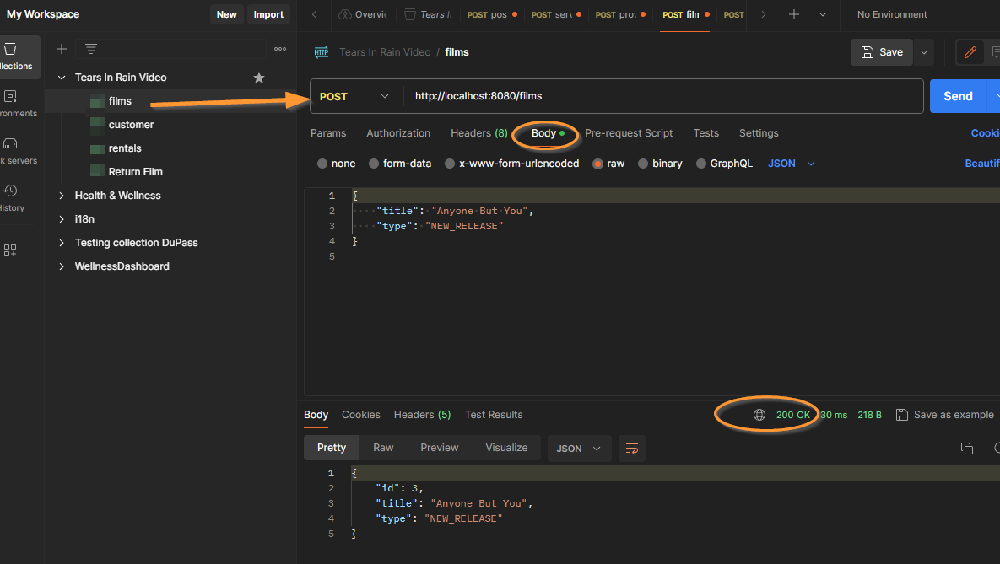
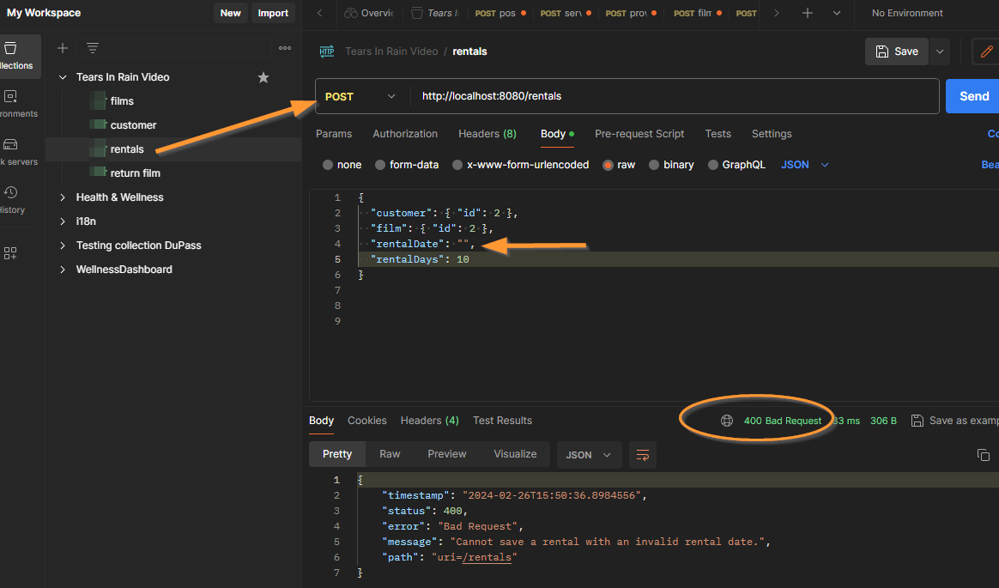
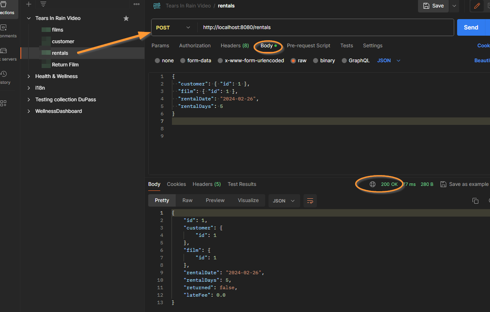
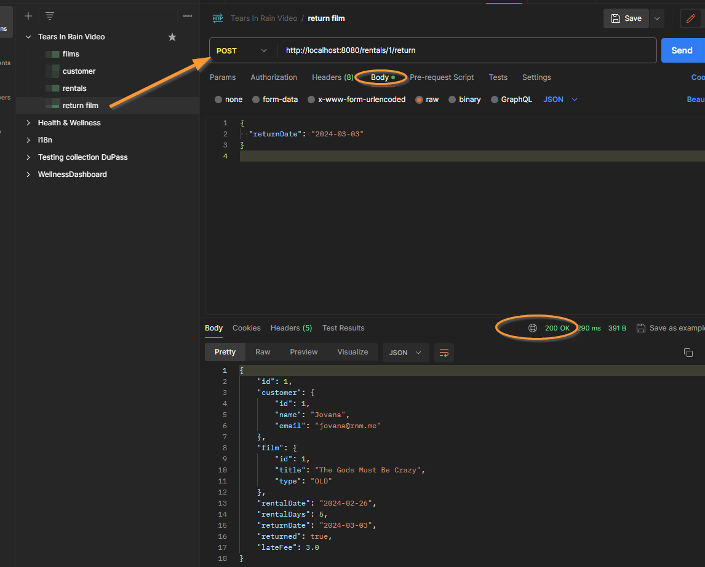

# 'Tears in Rain' Video Rental Store Project

## Overview
'Tears in Rain' stands as a beacon of simplicity. Crafted with Spring Boot, wielding the modern might of Java. Named as a tribute to the poignant final moments of Roy Batty. "Blade Runner" — this system honors the brevity of existence. Roy Batty, a Nexus-6 combat model replicant, led a renegade group in search of more lifespan. Batty's lifespan spanned a mere 1,387 days. In every interaction, 'Tears in Rain' aims to capture the essence of making each moment count, just as Batty did.

## How to Run
- Clone the repository
- Navigate to the project directory
- Run `mvn spring-boot:run` to start the application
- Use Postman for testing

## Features
- Manage a film inventory
- Calculate rental prices, including late fees

## Tech Stack

**Java 17**: The fresh brew, the latest features without the jitters of legacy issues

**Spring Boot**: Like a Swiss Army knife, Spring Boot slices through boilerplate and configures everything but morning coffee

**Maven**: Our project's librarian, meticulously organizing our volumes of dependencies

**Lombok**: The magician in the codebase, pulling getters, setters, and builders out of a hat with simple annotations

**H2 database**: in-memory database that's fast, disappearing and reappearing, like a ninja

## Decisions

- **Domain-Driven Design** - embraced to ensure our code mirrors the real-world model of our video store
- **Entity separation** - each entity (`Film`, `Customer`, `Rental`) was crafted to represent distinct real-world concepts
- **Service layer abstraction** - service interfaces (`FilmService`, `RentalService`, `CustomerService`), we've ensured that our business logic promotes scalability
- **Repository Pattern** - data access, it decouples the business logic from the data layer, making our data queries a breeze to test and evolve
- **Custom exceptions** - handle specific domain errors (in addition to API with RESTful error responses)
- **Lombok integration** - keep our code DRY and clean
- **In-memory database** - for development ease, reflecting the transient nature of... :)
- **Validated through Postman** -  despite a demanding week with critical production deployment, in my current role, the basic functionality implemented has been tested to demonstrate the video rental system

- **Naming** - All names of methods, variables, and other elements are self-explanatory for the simplicity of modern communication through code.

## Notes
In this case, the currency is EUR. The application could still be refined to contain implemented test scenarios, and it could also be more complex to manipulate the rental of movies in the backend, and then all of that would be nicely formed for handling via the web interface.
